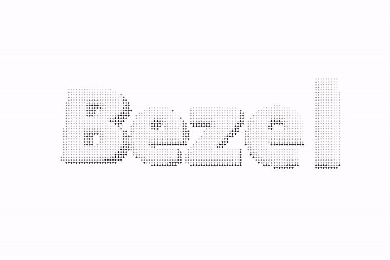
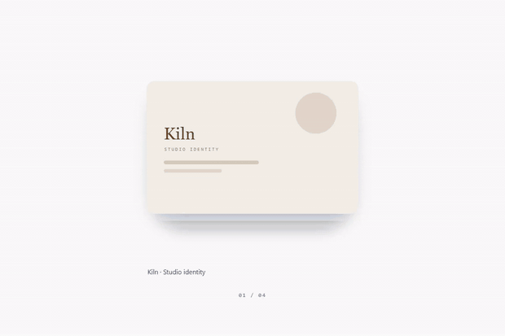
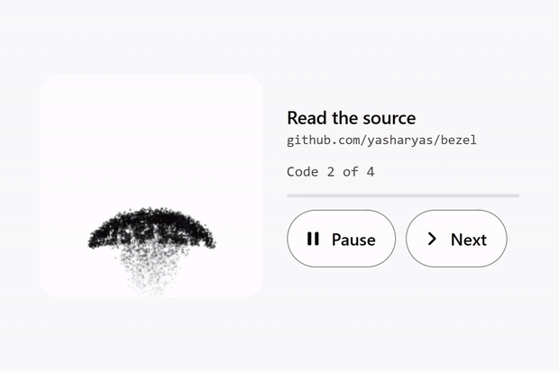
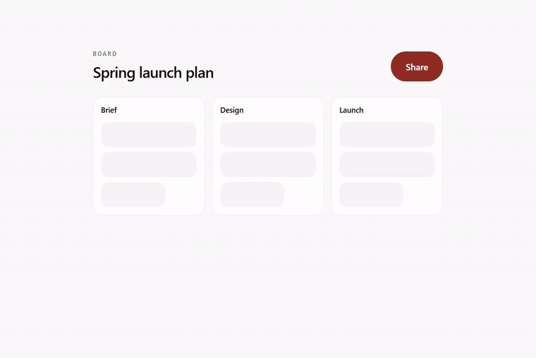
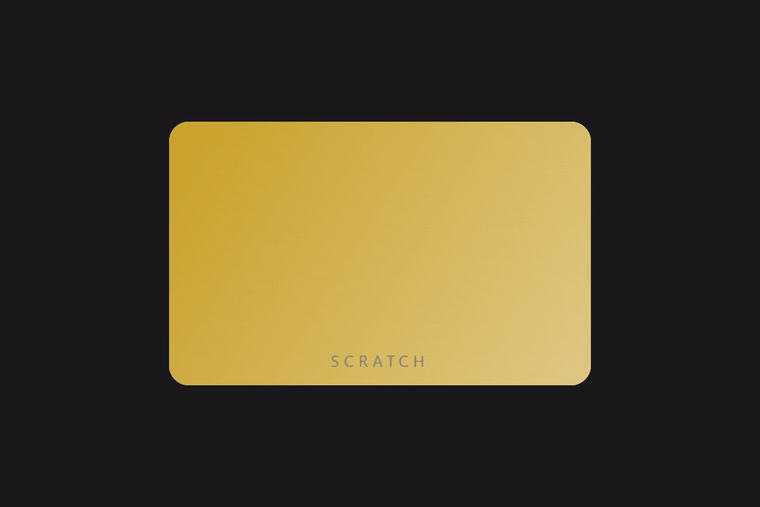
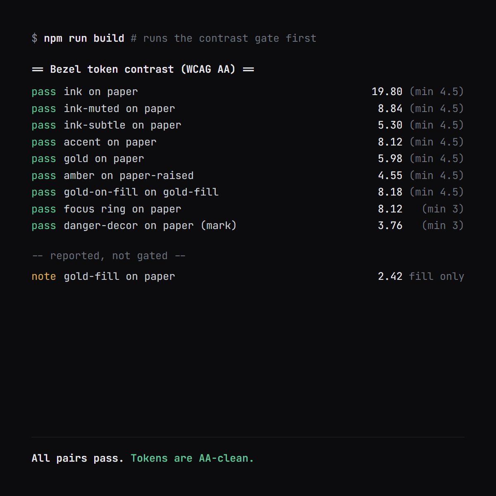

<div align="center">



<h1>Yash Arya</h1>

<p>Design engineer in New Delhi. Software engineer at Pelocal Fintech, where I design what I build.</p>

<a href="https://www.npmjs.com/package/bezel-ui"></a>
<a href="https://bezel-ui.vercel.app"></a>
<a href="https://github.com/yasharyas/bezel/blob/main/LICENSE"></a>

</div>

I prototype in the browser rather than in Figma. A hover that reads well in a static frame can be useless on a phone.

## bezel

An open source React component library. Components are copied into your project as source, so you own them from then on.

```bash
npm i bezel-ui
npx bezel-add add scroll-flip-deck
```

<table>
<tr>
<td width="50%" valign="top">



**ScrollFlipDeck.** Pins to the viewport and turns one card per scroll step. Plain transforms, no scroll library and no 3D library.

</td>
<td width="50%" valign="top">



**ParticleQrCode.** Falls apart and reassembles every few seconds, and still scans. Every code is decoded from the rendered canvas.

</td>
</tr>
<tr>
<td width="50%" valign="top">



**MorphDialog.** Grows out of the button you pressed, keeps keyboard focus inside, and hands it back when it closes.

</td>
<td width="50%" valign="top">



**ScratchFoilReveal.** Clear 55% of the foil and it dissolves the rest for you. No keyboard path yet, so it is not finished.

</td>
</tr>
</table>

### contrast is a build gate



Every colour pair the library can measure gets printed with its ratio. One below WCAG AA fails the build, so the gallery cannot deploy with unreadable text in it.

90 components, after a round of deletions. What went was one shop's checkout screen rather than a library.

[gallery](https://bezel-ui.vercel.app) · [source](https://github.com/yasharyas/bezel)

## paigam

[paigam.co.in](https://paigam.co.in). Wedding invitations that live at a link instead of a PDF.

A PDF cannot change when the venue moves, and it cannot take an RSVP. Designed and built solo, 32 designs, most rooted in a specific tradition rather than a recolour.

## elsewhere

[yash-arya.com](https://yash-arya.com) is the portfolio. The Paigam case study is at [yash-arya.com/design](https://yash-arya.com/design).

[X](https://x.com/yasharyaaa) · [LinkedIn](https://www.linkedin.com/in/yash--arya) · [yasharya2601@gmail.com](mailto:yasharya2601@gmail.com)
